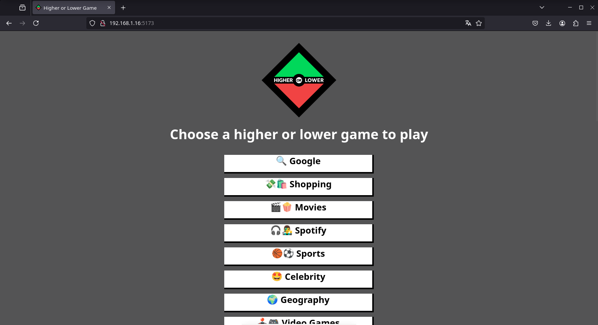
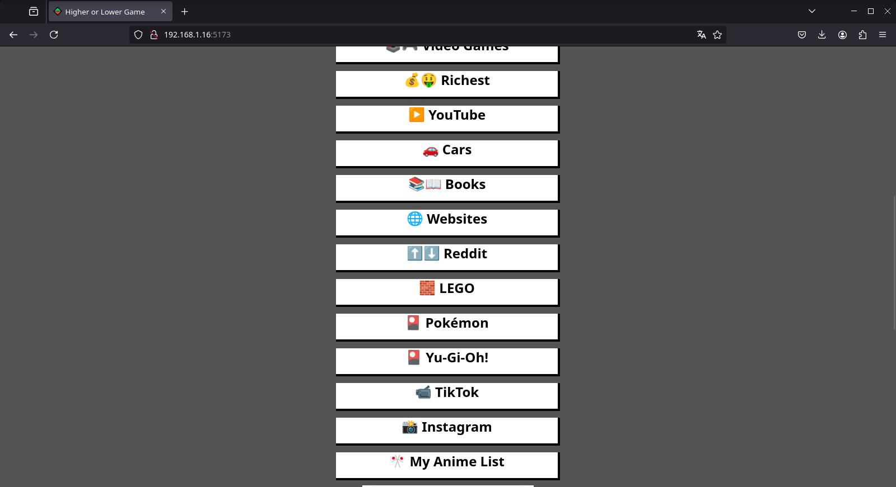
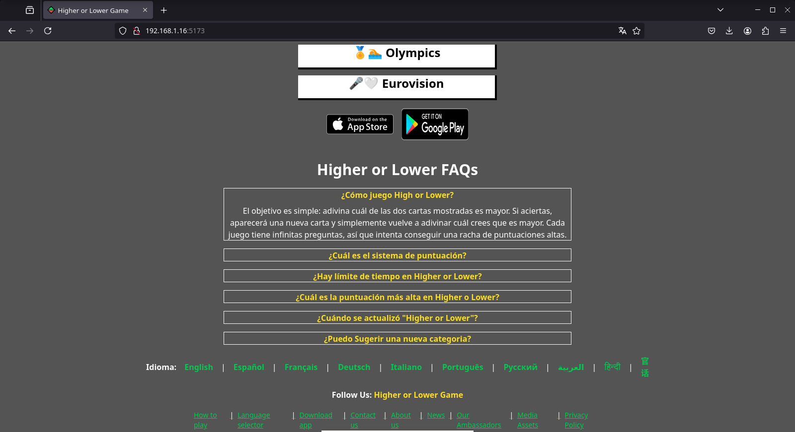
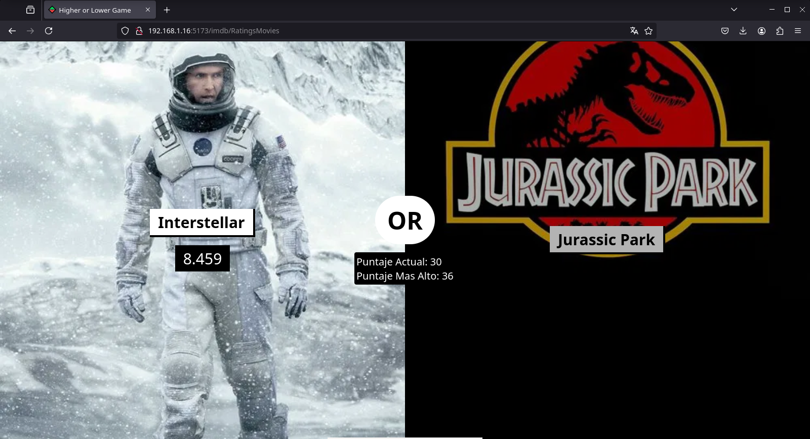
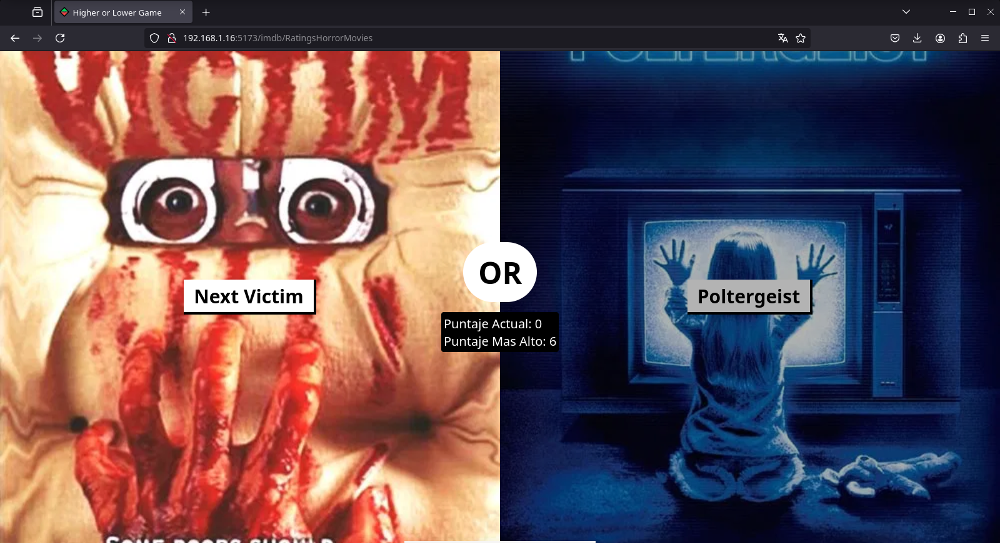

# Clon de HigherOrLowerGame
Clon del juego Higher or Lower (https://www.higherorlowergame.com/) desarrollado con Flask y React.

## Sobre el Juego

Adivina cuál de las dos cartas mostradas es mayor. Si aciertas, aparecerá una nueva carta y simplemente vuelve a adivinar cuál crees que es mayor. Cada juego tiene infinitas preguntas, así que esfuérzate por conseguir una racha de puntuaciones altas. 

## Inicio rápido con Docker

### Configurar el archivo `.env` de ejemplo
```
SERVER_PORT=5001
TMDB_API_KEY='456a9367b3718812d8c50b36c5b2a763'     # Conseguir si TMDB API Key para el modo de juego "🎬🍿Movies"

HOST_IP=192.168.1.16          # ¡MODIFICAR! Reemplaza con tu IP local
VITE_API_URL=http://${HOST_IP}:${SERVER_PORT}
```
### Levantar los contenedor y acceder a la aplicación web
```
docker compose up --build
```
Accede a la aplicación web desde cualquier dispositivo en tu red local usando: `http://HOST_IP:5173` (En el ejemplo: `http://192.168.1.16:5173`)

<p align="center"> 
    
    
    
</p>

## Modos de juego disponibles

### 🎬🍿 Movies

| 🎬⭐ Ratings: Movies | 🎌🎬⭐ Score: Anime Movies | 😱🎬⭐ Ratings: Horror Movies |
|---------------------|--------------------------|-----------------------------|
|  |  |  |

